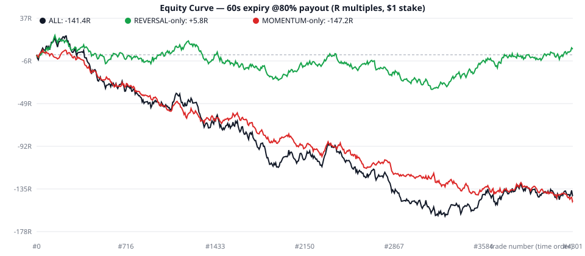
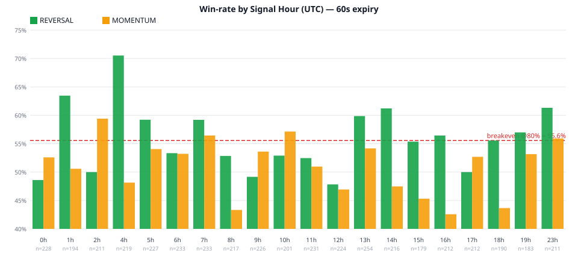

# Backtest Report — EMA Combo Strategy (`emacombo.py`)

**তারিখ:** 2026-09-10 | **ডেটা:** `candles_asset_1861_60s_365d.csv` | **ব্যাকটেস্ট ইঞ্জিন:** `backtest.py`

---

## ⚡ সংক্ষিপ্ত রায় (Verdict)

| প্রশ্ন | উত্তর |
|---|---|
| বর্তমান স্ট্র্যাটেজি কি লাভজনক? (60s expiry, 80% payout) | ❌ **না — statistically significant লস** |
| Win-rate | **53.66%** (breakeven দরকার 55.56%) |
| 4,301 ট্রেডে মোট ফল | **−141.4R** (প্রতি $1 stake-এ −$141; $10 stake-এ −$1,414) |
| সমস্যা কোথায়? | **MOMENTUM মডিউল:** 51.22% WR, −147.2R — পুরো লস এখান থেকে |
| আশার আলো | **REVERSAL মডিউল:** 55.70% WR, +5.8R — 80% payout-এ breakeven-এর ঠিক উপরে, এবং ৩ মাসেই stable |
| সেরা expiry | **60s** — 120s/300s আরও খারাপ |

> **এক লাইনে:** MOMENTUM বন্ধ করে REVERSAL-only চালালে স্ট্র্যাটেজি লস থেকে breakeven-এ আসে। Hour-filter যোগ করলে in-sample-এ লাভ দেখায়, কিন্তু সেটা forward-test ছাড়া বিশ্বাস করা যাবে না।

---

## ১. ডেটা ও ব্যাকটেস্ট পদ্ধতি

### ডেটা
| বিষয় | তথ্য |
|---|---|
| ফাইল | `candles_asset_1861_60s_365d.csv` |
| ক্যান্ডেল | **61,419টি × 1-minute** |
| সময়কাল | 2026-07-12 → 2026-09-10 = **59.5 দিন (~২ মাস)** |
| ⚠️ নোট | ফাইলের নামে "365d" লেখা থাকলেও **এটা ১ বছরের ডেটা নয়, মাত্র ~২ মাসের** |
| মার্কেট | শনি-রবি বন্ধ (weekend gap আছে) → **লাইভ ফরেক্স সেশন** (OTC নয়); প্রাইস 1.135–1.171 (EURUSD-ধাঁচের asset) |
| গ্যাপ | 11টি (8× ~48h weekend + 3× ~6.5h) — ব্যাকটেস্টে কোনো ট্রেড গ্যাপে পড়েনি ✅ |

### পদ্ধতি (লাইভ বটের হুবহু নকল)
- প্রতিটি ক্যান্ডেল `Strategy.update_candle(60, candle)`-এ খাওয়ানো হয়েছে — **ঠিক যেভাবে `bot.py` কল করে**।
- সিগন্যাল আসে নতুন ক্যান্ডেলের **OPEN-এ**, ভিত্তি = ঠিক আগের **closed ক্যান্ডেল** → কোনো look-ahead bias নেই ✅
- **Entry price** = সিগন্যাল ক্যান্ডেলের open; **60s expiry price** = পরের ক্যান্ডেলের open (কাঁটায়-কাঁটায় expiry মুহূর্তের প্রাইস)
- CALL জেতে যদি expiry > entry, PUT জেতে যদি expiry < entry, সমান হলে **DRAW (টাকা ফেরত)**
- `MAX_CONCURRENT_TRADES=1` enforce করা হয়েছে (60s-এ overlap হয় না; 120s/300s-এ overlapping সিগন্যাল বাদ গেছে)
- বেস **payout 80%** (IQ Option-এর typical 70–90%); ফলাফল **R-মাল্টিপলে** ($1 stake = 1R; win = +0.8R, loss = −1R)

---

## ২. মূল ফলাফল — Expiry তুলনা (@80% payout)

| Expiry | ট্রেড | Win | Loss | Draw | Win-rate | Breakeven | Net (R) | Profit Factor | Expectancy/ট্রেড |
|---|---|---|---|---|---|---|---|---|---|
| **60s** ✅ | 4,301 | 2,222 | 1,919 | 160 | **53.66%** | 55.56% | **−141.4R** | 0.926 | −0.034R |
| 120s | 3,979 | 2,014 | 1,869 | 96 | 51.87% | 55.56% | −257.8R | 0.862 | −0.067R |
| 300s | 3,281 | 1,611 | 1,616 | 54 | 49.92% | 55.56% | −327.2R | 0.798 | −0.101R |

- **60s-ই সেরা** — expiry বাড়ালে win-rate ও লাভ দুটোই খারাপ হয়।
- 60s win-rate-এর 95% confidence interval: **52.14% – 55.17%** — পুরোটাই breakeven (55.56%)-এর নিচে। z-test p-value = **0.014** → লসটা "bad luck" নয়, statistically significant।
- নিচের ইকুইটি কার্ভে কালো লাইন (ALL) ক্রমাগত নিচে নামছে:



---

## ৩. আসল খবর: MOMENTUM বনাম REVERSAL 🎯

এই ব্যাকটেস্টের **সবচেয়ে গুরুত্বপূর্ণ আবিষ্কার** — দুই মডিউলের আকাশ-পাতাল পার্থক্য:

| মডিউল | ট্রেড | Win-rate | Net (R) | Profit Factor | Max DD |
|---|---|---|---|---|---|
| **MOMENTUM** (pos 0.60–0.85, ট্রেন্ডের দিকে) | 1,967 | 51.22% | **−147.2R** ❌ | 0.840 | 155.2R |
| **REVERSAL** (pos ≥ 0.90, ট্রেন্ডের বিপরীতে) | 2,334 | **55.70%** | **+5.8R** ⚠️ | 1.006 | 55.6R |

- পুরো স্ট্র্যাটেজির লস (−141R) কার্যত **MOMENTUM-এর একার অবদান (−147R)**।
- REVERSAL প্রতি মাসে stable: Jul **55.02%** → Aug **55.47%** → Sep **57.64%** (কখনোই 55%-এর নিচে নামেনি)।
- MOMENTUM প্রতি মাসেই লস: Jul 49.84% → Aug 51.04% → Sep 54.43%।
- Direction-এ কোনো edge নেই: CALL 53.56% vs PUT 53.76% (সমান)। BULLISH মার্কেটে (54.55%) BEARISH-এর (52.74%) চেয়ে সামান্য ভালো।

### What-if: MOMENTUM বন্ধ করলে কী হতো?
| ভ্যারিয়েন্ট | ট্রেড | WR | Net @80% | মন্তব্য |
|---|---|---|---|---|
| A: **REVERSAL-only** | 2,334 | 55.70% | **+5.8R** | Breakeven-এর ঠিক উপরে; সবচেয়ে robust পরিবর্তন ✅ |
| B: REVERSAL + সেরা hours {1,4,13,14,23} | 593 | 62.83% | +75.0R | ⚠️ in-sample optimization — forward-test ছাড়া বিশ্বাস কোরো না |
| C: REVERSAL + Mon/Tue শুধু | 953 | 58.61% | +50.4R | ⚠️ একই সতর্কতা — overfitting-এর ঝুঁকি |

---

## ৪. Payout Sensitivity (60s) — কত payout দরকার?

| Payout | Breakeven WR | Net (R) | লাভ/লস |
|---|---|---|---|
| 70% | 58.82% | −363.6R | ❌❌ |
| 75% | 57.14% | −252.5R | ❌ |
| **80%** | 55.56% | −141.4R | ❌ |
| 85% | 54.05% | −30.3R | ❌ (কাছাকাছি) |
| 90% | 52.63% | +80.8R | ✅ (কিন্তু 90% payout বাস্তবে দুর্লভ) |

- পুরো স্ট্র্যাটেজির breakeven-এর জন্য দরকার **86.4% payout** — IQ Option-এ নিয়মিত পাওয়া যায় না।
- **REVERSAL-only-এর দরকার 79.5%** → payout ≥80% হলেই এটা লাভে থাকে। এজন্য বটে **payout ফিল্টার বাধ্যতামূলক**।

---

## ৫. সময়ভিত্তিক বিশ্লেষণ (সিগন্যাল ক্যান্ডেলের UTC সময়)



### Hour-wise (সেরা ও খারাপ 5টি, সব ট্রেড)
| সেরা hour | WR | Net | | খারাপ hour | WR | Net |
|---|---|---|---|---|---|
| 23h | 58.79% | +11.6R | | 12h | 47.42% | −31.2R |
| 4h | 58.62% | +11.2R | | 8h | 48.83% | −25.8R |
| 7h | 57.96% | +9.8R | | 16h | 49.50% | −22.0R |
| 13h | 57.66% | +9.4R | | 0h | 50.67% | −19.6R |
| 1h | 57.67% | +7.2R | | 9h | 51.15% | −17.2R |

- REVERSAL-এর মধ্যে **4h UTC সবচেয়ে উজ্জ্বল: 70.53% WR (n=101), +25.6R** — তবে স্যাম্পল ছোট (~100), এটা কাকতালীয়ও হতে পারে।
- বিদ্যমান `SKIP_HOURS = {3, 20, 21, 22}` ঠিকমতো কাজ করছে ✅ (এই hours-এ শূন্য ট্রেড)।
- **সতর্কতা:** 20টি hour থেকে সেরা 5টা বেছে নেওয়া মানেই overfitting-এর ফাঁদ। Hour-ফিল্টার শুধুমাত্র paper-trading-এ validate করে তারপর চালু করো।

### Weekday ও Month
| Day | WR | Net | | Month | WR | Net |
|---|---|---|---|---|---|
| Tue | 55.73% | +2.6R | | Jul | 52.73% | −73.8R |
| Mon | 54.39% | −18.4R | | Aug | 53.39% | −76.2R |
| Wed | 53.43% | −32.8R | | **Sep (10 দিন)** | 56.21% | +8.6R |
| Fri | 52.84% | −35.2R | | | | |
| Thu | 52.01% | −52.2R | | | | |

- REVERSAL Mon/Tue-তে শক্তিশালী (+18.2R/+32.2R), Wed–Fri দুর্বল — কিন্তু এটাও ছোট-স্যাম্পল প্যাটার্ন হতে পারে।

---

## ৬. ঝুঁকি চিত্র — এটা না পড়ে লাইভে যেও না ⚠️

| মেট্রিক | মান | মানে কী |
|---|---|---|
| ট্রেড/দিন (গড়) | **81.2** | খুব high-frequency — স্প্রেড/স্লিপেজের খরচ বেশি |
| সবুজ দিন | 20/53 (**37.7%**) | ৩ দিনের ২ দিনই লসে শেষ |
| দৈনিক গড় | **−2.67R**, সেরা +16.8R / খারাপ −24.0R | |
| Max Drawdown | **185.6R** | $10 stake-এ **−$1,856** ড্রডাউন — ছোট ব্যালেন্স মুছে যাবে |
| Max loss streak | **11 টানা লস** | Martingale/ডাবলিং করলে অ্যাকাউন্ট শেষ — **কঠোর নিষেধ** |
| Max win streak | 11 | |
| REVERSAL-only Max DD | 55.6R | MOMENTUM বাদ দিলে ড্রডাউন ⅓-এ নেমে আসে |

**ব্যাংকরোল গণিত:** $10/trade-এ 59 দিনে ফল −$1,414; REVERSAL-only হলে +$58। 1–2% risk-per-trade নিয়মে $10 stake-এর জন্য **ন্যূনতম $1,000–$2,000 ব্যালেন্স** দরকার (DD 185R কভার করতে)।

---

## ৭. এই ব্যাকটেস্ট কি বিশ্বাসযোগ্য? (Validity checks)

| চেক | ফলাফল |
|---|---|
| Look-ahead bias | ✅ নেই — সিগন্যাল শুধু closed ক্যান্ডেল দেখে, এন্ট্রি পরের ক্যান্ডেলের open-এ |
| Candle গণনা মিল | ✅ 57,118 no-trade + 4,301 signal = 61,419 (100% মিলেছে) |
| Weekend/gap দূষণ | ✅ শূন্য — সব ট্রেডের expiry contiguous ডেটায় |
| Expiry-price পদ্ধতির robustness | ✅ `close[i]` দিয়ে মাপলেও WR 53.87%, net −126R — সিদ্ধান্ত বদলায় না (মাত্র 5.2% ট্রেডে ফলাফল পাল্টায়, boundary gap গড়ে 0.05 pip) |
| Draw kezelés | ✅ Draw = stake ফেরত (0R), win-rate থেকে বাদ |
| Overlap handling | ✅ 120s-এ 322টি, 300s-এ 1,020টি overlapping সিগন্যাল বাদ দেওয়া হয়েছে (বটের মতোই) |

### No-trade কারণ (ফিল্টার কী কী আটকেছে)
| কারণ | সংখ্যা | অর্থ |
|---|---|---|
| CANDLE_COLOUR_MISMATCH | 24,647 | ক্যান্ডেলের রঙ ট্রেন্ডের বিপরীত |
| RANGE_TOO_SMALL | 19,503 | রেঞ্জ < 1.2×ATR (দুর্বল impulse) |
| SKIP_HOUR | 9,936 | নিষিদ্ধ hour (3, 20, 21, 22) |
| BODY_TOO_SMALL | 2,072 | body/range < 50% |
| CLOSE_POSITION_OUT_OF_ZONE | 944 | pos 0.85–0.90 dead-zone বা < 0.60 |
| EMA_NOT_READY / FLAT | 15 / 1 | warmup |

---

## ৮. সীমাবদ্ধতা (যা এই ব্যাকটেস্ট ধরেনি)

1. **Slippage/latency:** লাইভে সিগন্যাল→এন্ট্রিতে ~0.3–1s দেরি হয়; 60s binary-তে 0.1 pip-ও ফল পাল্টাতে পারে।
2. **Payout ওঠানামা:** বাস্তবে payout সবসময় 80% থাকে না — খবর/ভোলাটিলিটির সময় কমে। আর এই স্ট্র্যাটেজি **ভোলাটাইল ক্যান্ডেলেই ট্রেড করে**, অর্থাৎ ঠিক যখন payout কমার সম্ভাবনা বেশি!
3. **৩০ সেকেন্ড expiry টেস্ট করা যায়নি** — `bot.py`-এর default 30s, কিন্তু 1-minute ডেটা দিয়ে 30s expiry-এর সঠিক ব্যাকটেস্ট অসম্ভব (tick-ডেটা লাগবে)।
4. **মাত্র ৫৯ দিনের ডেটা** — ১ বছরের ডেটা পেলে সিদ্ধান্ত আরও পোক্ত হবে।
5. অতীতের ফল ভবিষ্যতের গ্যারান্টি নয় — বিশেষ করে REVERSAL edge-টা ছোট (55.7% vs 55.56% breakeven)।

---

## ৯. সুপারিশ (অগ্রাধিকার ক্রমে)

1. **🔴 MOMENTUM মডিউল বন্ধ করো** — `emacombo.py`-তে `ENABLE_MOMENTUM = False` ফ্ল্যাগ যোগ করে শুধু REVERSAL চালাও। এটাই এক নম্বর পরিবর্তন।
2. **🔴 Expiry 60s-এ রাখো** — 120s/300s প্রমাণিতভাবে খারাপ। (30s চালাতে চাইলে আগে tick-ডেটা দিয়ে আলাদা ব্যাকটেস্ট লাগবে।)
3. **🟡 বটে payout ফিল্টার যোগ করো** — payout < 80% হলে ট্রেড নিও না (REVERSAL-এর breakeven 79.5%)।
4. **🟡 Daily stop-loss + max trades/day** — যেমন দিনে −10R বা 40 ট্রেডে থামো (এখন দিনে গড়ে 81টা ট্রেড হয়!)।
5. **🟢 Hour-ফিল্টার এখনই নয়** — 4h/23h/1h/13h/14h প্যাটার্নটা 2–4 সপ্তাহ paper-trade-এ validate করো, তারপর হার্ডকোড করো।
6. **🟢 Martingale কখনোই নয়** — 11 টানা লসের ইতিহাস আছে।
7. **🔵 ১ বছরের আসল ডেটা জোগাড় করে এই ব্যাকটেস্ট আবার চালাও** (`python3 backtest.py` এক কমান্ডেই হবে)।

---

## ১০. ফাইল ও পুনরুৎপাদন

| ফাইল | কাজ |
|---|---|
| `backtest.py` | ব্যাকটেস্ট ইঞ্জিন (stdlib-only, লাইভ লজিকের হুবহু নকল) |
| `make_charts.py` | SVG চার্ট জেনারেটর |
| `backtest_trades_60s.csv` | 4,301 ট্রেডের পূর্ণ তালিকা (এন্ট্রি/এক্সপায়ারি/মডিউল/EMA/ATR সহ) |
| `backtest_summary.json` | সব মেট্রিক + breakdown (machine-readable) |
| `chart_equity.svg` / `chart_hourly.svg` | ইকুইটি কার্ভ ও hour-wise চার্ট |
| `BACKTEST_REPORT.md` | এই রিপোর্ট |

```bash
python3 backtest.py      # ব্যাকটেস্ট চালাও → backtest_trades_60s.csv + backtest_summary.json
python3 make_charts.py   # চার্ট বানাও → chart_equity.svg + chart_hourly.svg
```

---

*⚠️ ডিসক্লেইমার: এটা শিক্ষামূলক ব্যাকটেস্ট রিপোর্ট, আর্থিক পরামর্শ নয়। Binary option উচ্চ-ঝুঁকির প্রোডাক্ট — লাইভ টাকায় চালানোর আগে ডেমোতে যাচাই করো।*
