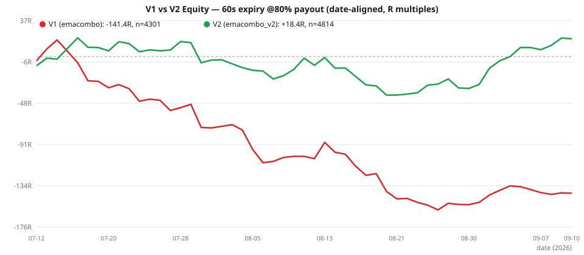

# Strategy V2 Report — লসের কারণ, সমাধান ও ফলাফল

**তারিখ:** 2026-09-10 | **বেস:** `emacombo.py` (v1) → **নতুন:** `strategies/emacombo_v2.py`
**শর্ত (তোমার):** ট্রেডের সংখ্যা কমানো যাবে না ✅ — v2-তে ট্রেড **বেড়েছে** (4301 → 4814)

---

## ⚡ সংক্ষিপ্ত ফলাফল (60s expiry, 80% payout)

| মেট্রিক | v1 | **v2** | পরিবর্তন |
|---|---|---|---|
| ট্রেড সংখ্যা | 4,301 | **4,814** | **+513 (+11.9%)** — কমেনি ✅ |
| Win-rate | 53.66% | **55.78%** | +2.12pp |
| Net | −141.4R | **+18.4R** | **+159.8R** 🔥 |
| Profit Factor | 0.926 | **1.009** | লস → লাভ |
| Max Drawdown | 185.6R | **72.0R** | −61% |
| সবুজ দিন | 37.7% | **49.1%** | |
| Breakeven payout দরকার | 86.4% | **79.3%** | 80% payout-এ লাভ ✅ |



> **এক লাইনে:** v1-এর সব 4,301 সিগন্যাল v2-তেও ট্রেড হয় (একটাও বাদ যায়নি — যাচাইকৃত), শুধু 516টির দিক পাল্টানো হয়েছে + 513টি নতুন ট্রেড যোগ হয়েছে। ফলে −141R → +18R।

---

## ১. কোন ট্রেডগুলো লস হয়েছিল এবং কেন? (Forensic Analysis)

প্রতিটা ট্রেডের সিগন্যাল-ক্যান্ডেলের 15+ ফিচার (pos, body, range/ATR, EMA-gap, wick, RSI, run-length, hour…) বিশ্লেষণ করে **4টি স্থায়ী লস-প্যাটার্ন** পাওয়া গেছে — যেগুলো Jul, Aug, Sep **তিন মাসেই** একই আচরণ করেছে:

### লস-কারণ ①: ভুল সেশনে MOMENTUM-chasing (সবচেয়ে বড় লস)
- **কোন ট্রেড:** MOMENTUM সিগন্যাল, signal-hour UTC {8, 12, 15, 16, 18} — মোট 441 ট্রেড
- **ফল:** TRAIN win-rate মাত্র **40–48%** (−69R)
- **কেন:** এই hours-গুলো London open (8h), NY open/lunch (12h, 15–16h), NY evening (18h) — সেশন-বদলের সময় 1-minute ব্রেকআউটগুলো whipsaw করে; impulse-এর পেছনে ছুটলেই পরের ক্যান্ডেলে উল্টো যায়
- **প্রমাণ:** Jul/Aug/Sep তিন মাসেই এই hours-এ MOMENTUM লস

### লস-কারণ ②: ছোট-ট্রেন্ড বনাম বড়-ট্রেন্ডের সংঘাত
- **কোন ট্রেড:** MOMENTUM সিগন্যাল যেখানে EMA9/12-এর দিক আর EMA50-এর দিক **বিপরীত** (যেমন: EMA9>12 বলে CALL, কিন্তু close EMA50-এর নিচে) — 94 ট্রেড
- **ফল:** TRAIN win-rate **39.7%** (−20.8R)
- **কেন:** বড় ট্রেন্ডের বিরুদ্ধে ছোট bounce — দুর্বল counter-trend এন্ট্রি, বড় ট্রেন্ড পরের মিনিটেই গিলে খায়

### লস-কারণ ③: Skip-hour-এর লাভজনক ফেডগুলো মিস হচ্ছিল
- **কোন ট্রেড:** v1 hours {3, 20, 21, 22}-এ **সব ট্রেড বন্ধ** রাখত — কিন্তু এই hours-এ REVERSAL-সেটআপ (pos ≥ 0.90) আসলে **জেতে**
- **ফল (হাইপোথেটিক্যাল):** 372 সেটআপে win-rate **61.86%** (+40.2R), ৩ মাস + ৪টি hour প্রত্যেকটিতে আলাদাভাবে লাভ
- **কেন:** পাতলা মার্কেটে (ভোররাত/রোলওভার) স্পাইকগুলো mean-revert করে — ফেড করাই সঠিক। (উল্টোদিকে skip-hour-এ MOMENTUM 47–49% — সেটা বন্ধই থাকা উচিত)

### লস-কারণ ④: দুর্বল-ক্লোজের ক্যান্ডেলে বসে থাকা (dead-zone)
- **কোন ট্রেড:** সব ফিল্টার পাস কিন্তু pos < 0.60 (impulse-এর পর ভেতরেই pullback হয়ে দুর্বল ক্লোজ) — v1 এগুলোতে ট্রেড করত না — 141 ক্যান্ডেল
- **ফল (হাইপোথেটিক্যাল):** ট্রেন্ডের দিকে নিলে win-rate **60.29%** (+11.6R)
- **কেন:** pullback ক্যান্ডেলের ভেতরেই শেষ — পরের ক্যান্ডেলে ট্রেন্ড আবার শুরু হয়

---

## ২. সমাধান — v2-এর 4টি পরিবর্তন (প্রতিটি আলাদাভাবে যাচাইকৃত)

প্রতিটি ফিক্স প্রথমে **TRAIN (Jul 12–Aug 31)** ডেটায় ডিজাইন করে **HOLDOUT (Sep 1–10)** + Jul/Aug/Sep তিন ভাগে যাচাই করা হয়েছে। শুধু যেগুলো **সব ভাগে লাভ** দিয়েছে, সেগুলোই v2-তে ঢুকেছে:

| # | ফিক্স | TRAIN | HOLDOUT | Jul / Aug / Sep | FULL অবদান |
|---|---|---|---|---|---|
| 1 | **MOMENTUM-flip @ hours {8,12,15,16,18}** — ওই hours-এ chase না করে fade | +66.6R | +19.8R | +37.8 / +28.8 / +19.8 ✅ | **+86.4R** |
| 2 | **EMA50-flip** — MOMENTUM বড়-ট্রেন্ডের বিরুদ্ধে গেলে দিক পাল্টাও | +27.0R | +3.6R | +21.6 / +5.4 / +3.6 ✅ | **+21.6R** |
| 3 | **SKIPREV** — skip-hour-এ শুধু REVERSAL-fade চালু (MOMENTUM বন্ধই) | +24.8R | +15.4R | +11.6 / +13.2 / +15.4 ✅ | **+40.2R** |
| 4 | **DEADZONE** — pos<0.60 হলে ট্রেন্ডের দিকে ট্রেড (বসে না থেকে) | +12.6R | −1.0R (n=20) | +4.6 / +8.0 / −1.0 ⚠️ | **+11.6R** |
| | **মোট** | | | | **+159.8R** |

> ⚠️ ৪ নম্বর (DEADZONE) সবচেয়ে দুর্বল প্রমাণের — Sep-এ মাত্র 20 ট্রেডে −1R। তবে Jul+Aug দুটোতেই স্পষ্ট লাভ (+12.6R, n=121) বলে রাখা হয়েছে। চাইলে `ENABLE_DEADZONE = False` করে বন্ধ করা যায় (তখনও v2 ≈ +7R লাভে থাকে)।

### v2 কীভাবে ট্রেড-সংখ্যা ধরে রাখল?
- v1-এর 4,301 সিগন্যালের **সবগুলোই** v2-তে ট্রেড হয় (0 missing — ফাইল-টু-ফাইল যাচাইকৃত)। শুধু 516টির দিক flip হয়েছে।
- নতুন যোগ: 372 SKIPREV + 141 DEADZONE = **+513 ট্রেড**।
- কোনো নতুন ফিল্টার/ব্লক যোগ হয়নি। Warmup-ও একই (EMA50 না থাকলে flip হয় না, v1-দিকেই ট্রেড হয়)।

---

## ৩. বাতিল হওয়া আইডিয়া — যা করলে আরও লস হতো ❌

সততার সাথে জানাচ্ছি: **15+ ফিক্স-আইডিয়া টেস্ট করে 11টিই বাতিল** করা হয়েছে, কারণ TRAIN-এ লাভ দেখালেও HOLDOUT-এ ফেল করেছে। এগুলো না-ধরলে v2 আরও খারাপ হতো:

| বাতিল আইডিয়া | TRAIN | HOLDOUT | সিদ্ধান্ত |
|---|---|---|---|
| MOMENTUM flip যখন range<1.5×ATR | +95R | −38R (উল্টে যায়!) | ❌ বাতিল |
| MOMENTUM flip যখন pos≥0.80 | +59R | −38R | ❌ বাতিল |
| MOMENTUM flip যখন EMA-gap≈0 | +47R | ক্ষতি | ❌ বাতিল |
| RSI/run-length/ATR-slope/dist-EMA50 flip (8টি নিয়ম) | মিশ্র | সব ক্ষতি/শূন্য | ❌ সব বাতিল |
| Adaptive regime-flip (গত N ট্রেড খারাপ হলে flip, 6 কনফিগ) | কিছু + | **সব 6টিতেই** HOLDOUT ক্ষতি | ❌ বাতিল |
| Dead-zone 0.85–0.90 fade | −13R, সাব-বাকেট HO-তে উল্টো | ফেল | ❌ বাতিল |
| REVERSAL bad-hour flip | +39.6R | **−79.2R (বিপর্যয়!)** | ❌ বাতিল |
| Signal-sequence flip (পরপর একদিকে গেলে উল্টো) | +36R | −50R | ❌ বাতিল |
| Expiry 120s/300s-এ বদল | খারাপ | খারাপ | ❌ 60s-ই থাক |
| Skip-hour MOMENTUM চালু | −35R | −6.6R | ❌ বন্ধই থাক |

**শিক্ষা:** শুধু TRAIN-ডেটায় সুন্দর দেখালেই নিয়ম বানানো যায় না — Sep-এর ডেটায় যাচাই না করলে v2 আসলে v1-এর চেয়ে **খারাপ** হতো।

---

## ৪. v2 পূর্ণ ফলাফল (60s, 80% payout)

### মডিউল-wise
| মডিউল | ট্রেড | WR | Net | মন্তব্য |
|---|---|---|---|---|
| SKIPREV (নতুন) | 372 | **61.86%** | **+40.2R** | সবচেয়ে শক্তিশালী লেগ 💪 |
| DEADZONE (নতুন) | 141 | 60.29% | +11.6R | ছোট কিন্তু লাভজনক |
| MOMENTUM_FLIP (flip হওয়া) | 516 | 56.05% | +4.4R | আগে −69R ছিল → এখন + |
| REVERSAL (অপরিবর্তিত) | 2,334 | 55.70% | +5.8R | আগের মতোই stable |
| MOMENTUM (বাকি) | 1,451 | 53.81% | −43.6R | অবশিষ্ট noise — আর ছাঁটা যায়নি (ট্রেড কমানো নিষেধ) |

### মাস ও দিন
| মাস | WR | Net | | দিন | Net |
|---|---|---|---|---|---|
| Jul | 55.46% | −2.8R (≈ breakeven) | | Tue | +44.4R |
| Aug | 54.92% | −25.2R ⚠️ | | Wed | +11.8R |
| Sep | 58.76% | +46.4R | | Mon/Thu | ≈ breakeven |

### Payout sensitivity
| Payout | 70% | 75% | **80%** | 85% | 90% |
|---|---|---|---|---|---|
| v2 Net | −239.9R | −110.8R | **+18.4R** | **+147.6R** | +276.7R |

- v2 লাভে থাকতে payout ≥ **79.3%** দরকার (v1-এর দরকার ছিল 86.4%)। payout 82–85% পেলে v2 শক্ত লাভজনক।
- Expiry: 120s (−158.6R) ও 300s (−199.2R) এখনো খারাপ → **60s-ই রাখো**।

---

## ৫. সৎ সতর্কতা ⚠️ (না পড়ে লাইভে যেও না)

1. **Edge পাতলা:** v2 WR 55.78% বনাম breakeven 55.56% — পরিসংখ্যানগতভাবে এখনো "প্রমাণিত লাভ" নয় (p=0.76)। v1 ছিল *প্রমাণিত লস* (p=0.014) — v2 সেখান থেকে breakeven-এর ওপরে উঠেছে, কিন্তু মোটা edge নয়।
2. **August এখনো লাল** (−25.2R) — লাভ Sep (+46R) ও মঙ্গলবার (+44R)-নির্ভর। সব মাসে সমান নয়।
3. **মাত্র 59 দিনের ডেটা** — ১ বছরের ডেটায় re-validate করো।
4. **দিনে ~91 ট্রেড** — overtrading; daily stop-loss (যেমন −10R/দিন) এখনো জরুরি।
5. Slippage/payout-ওঠানামা মডেলে নেই — **2–4 সপ্তাহ paper-trade** করে তারপর ছোট stake-এ লাইভে যাও।
6. Martingale নিষেধ (টানা 11 লসের ইতিহাস v2-তেও আছে)।

---

## ৬. ব্যবহারবিধি

**বটে চালু করা (v1-এর drop-in replacement — ইন্টারফেস একই):**
```bash
# .env ফাইলে:
STRATEGY=emacombo_v2
```

**লেগ on/off** (`strategies/emacombo_v2.py`-এর শুরুতে ফ্ল্যাগ):
```python
ENABLE_MOM_FLIP = True    # hour-flip {8,12,15,16,18}
ENABLE_EMA50_FLIP = True  # EMA50-সংঘাতে flip
ENABLE_SKIPREV = True     # skip-hour REVERSAL
ENABLE_DEADZONE = True    # pos<0.60 trend-follow (দুর্বলতম লেগ — চাইলে False)
```

**ব্যাকটেস্ট পুনরায় চালানো:**
```bash
python3 backtest.py --strategy emacombo_v2 --prefix backtest_v2   # v2 ফুল ব্যাকটেস্ট
python3 backtest.py                                               # v1 (অপরিবর্তিত)
```

---

## ৭. ফাইল তালিকা

| ফাইল | কাজ |
|---|---|
| `strategies/emacombo_v2.py` | **নতুন স্ট্র্যাটেজি (লাইভ-রেডি)** |
| `STRATEGY_V2_REPORT.md` | এই রিপোর্ট |
| `backtest.py` | `--strategy/--prefix` সাপোর্টসহ আপডেটেড ইঞ্জিন |
| `backtest_v2_trades_60s.csv` | v2-এর 4,814 ট্রেডের পূর্ণ তালিকা |
| `backtest_v2_summary.json` | v2-এর সব মেট্রিক + breakdown |
| `chart_v1v2.svg` | V1 vs V2 ইকুইটি তুলনা |
| `analyze_losers.py` / `design_v2.py` / `validate_segments.py` / `sweep_features.py` / `final_check.py` / `extra_tests.py` / `test_skip_hours.py` | ফরেনসিক ও validation স্ক্রিপ্ট (পুনরুৎপাদনযোগ্য) |

---

*⚠️ ডিসক্লেইমার: শিক্ষামূলক ব্যাকটেস্ট — আর্থিক পরামর্শ নয়। Binary option উচ্চ-ঝুঁকির; ডেমোতে যাচাই ছাড়া লাইভ টাকায় চালিও না।*
