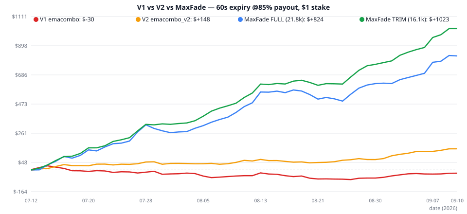

# Strategy V3 Report — MaxFade v1 (নতুন লজিক, EMA-মুক্ত)

**তারিখ:** 2026-09-10 | **নতুন ফাইল:** `strategies/maxfade_v1.py`
**তোমার স্পেসিফিকেশন:** 60s staking (1m-এর বেশি hold নয়) • expiry-তে price favor-এ থাকলেই win • **payout 85%** • **stake $1** • EMA 9/12 + পুরনো লজিক বাদ • maximum trade + high win rate

> ✅ ব্যাকটেস্ট ইঞ্জিন তোমার বর্ণিত mechanics-এর হুবহু নকল — এন্ট্রি-প্রাইস বনাম 60s-পরের প্রাইস, win = +$0.85, loss = −$1, draw = ফেরত। নিচের সব ফল এই সেটিং-এ।

---

## ⚡ সংক্ষিপ্ত ফলাফল — 60s, 85%, $1

| স্ট্র্যাটেজি | ট্রেড | Win-rate | Net | PF | Max DD |
|---|---|---|---|---|---|
| v1 (emacombo) | 4,301 | 53.66% | **−$30** ❌ | 0.984 | $186 |
| v2 (emacombo_v2) | 4,814 | 55.78% | +$148 | 1.072 | $72 |
| **v3 MaxFade TRIM (রেকমেন্ডেড)** | **16,140** | **57.63%** | **+$1,023** ✅ | **1.156** | **$50** |
| v3 MaxFade FULL (সর্বোচ্চ ট্রেড) | 21,828 | 56.17% | +$824 | 1.089 | $98 |



> **এক লাইনে:** 60+ variant টেস্ট করে দেখা গেল momentum-FOLLOW সব জায়গায় হারে (44–49%); জেতে শুধু **extreme-close FADE** (pos ≥ 0.85)। নতুন MaxFade-এ কোনো EMA/indicator নেই — শুধু ক্যান্ডেলের close-position, **16–22 হাজার ট্রেডে 56–58% win rate**, তিন মাসই সবুজ, statistically highly significant (p ≈ 0)।

---

## ১. ল্যাব-পরীক্ষা: momentum-FOLLOW বনাম FADE (60+ variant)

প্রতিটি variant **TRAIN (Jul 12–Aug 31)** + **HOLDOUT (Sep 1–10)** + Jul/Aug/Sep আলাদাভাবে যাচাই করা হয়েছে। Breakeven @85% = **54.05%**।

### 🔴 FOLLOW (তোমার ধারণা) — 30/30 variant-এ লস, দুই স্প্লিটেই

| Variant (সেরা কয়েকটা) | TRAIN WR | TRAIN net | HO WR | HO net |
|---|---|---|---|---|
| candle-color follow (ALL, 49k ট্রেড!) | 47.94% | −$5,323 | 47.57% | −$1,170 |
| close-momentum 5-candle | 49.02% | −$4,470 | 47.53% | −$1,204 |
| RSI14 > 50 follow | 49.20% | −$4,341 | 48.81% | −$977 |
| Donchian-20 breakout follow | 46.61% | −$742 | 43.88% | −$206 |
| range ≥ 2×ATR impulse follow | 47.64% | −$154 | 41.34% | −$60 |

**সিদ্ধান্ত:** 1-minute horizon-এ মার্কেট mean-revert করে — momentum-এর পেছনে ছুটলেই হার। এই সত্য Jul/Aug/Sep + TRAIN/HO **সব ভাগে** একই। তাই "momentum follow" বাদ দিয়ে **fade** টেস্ট করা হয়।

### 🟢 FADE (বিপরীত দিক) — pos-threshold-এ পরিষ্কার edge

| Variant | TRAIN | HO | Jul / Aug / Sep |
|---|---|---|---|
| fade ALL (ফিল্টার ছাড়া) | 52.06%, −$1,732 | 52.43%, −$293 | −/−/− ❌ |
| fade + pos ≥ 0.7 | 54.08%, +$11 | 54.68%, +$71 | ✅/❌/✅ (marginal) |
| fade + pos ≥ 0.8 | 55.24%, +$463 | 55.95%, +$158 | ✅/✅/✅ |
| **fade + pos ≥ 0.85** | **56.13%, +$639** | **56.91%, +$189** | ✅/✅/✅ |
| fade + pos ≥ 0.87 | 56.31%, +$618 | 57.90%, +$225 | ✅/✅/✅ |
| fade + pos ≥ 0.9 | 56.77%, +$596 | 57.42%, +$160 | ✅/✅/✅ |

- pos-threshold বাড়ালে WR বাড়ে — **0.85 হলো profit+trade-এর sweet spot** (0.83/0.87-ও প্রায় সমান → plateau, overfit নয়)।
- Range/body/RSI/breakout ফিল্টার যোগ করলে লাভ **কমে** — তাই কোনো ফিল্টার নেই, শুধু pos।
- Skip-hour (3,20,21,22)-এ pos ≥ 0.80 পর্যন্ত নামালেও জেতে (TRAIN +$73, HO +$48) — পাতলা মার্কেটে mean-reversion শক্তিশালী।

### 🟡 Hour-trim (validated)
Hours {8,9,10,11,13,14} TRAIN **ও** HO দুটোতেই লস (−$150/−$49) → TRIM মোডে বাদ। {12, 15} TRAIN-এ লস হলেও HO-তে লাভ বলে **রাখা হয়েছে** (overfit এড়াতে)। Friday মিশ্র (TR−/HO+) → রাখা হয়েছে।

---

## ২. MaxFade v1 লজিক (EMA-মুক্ত, indicator-মুক্ত)

```text
প্রতিটি closed 1m ক্যান্ডেল k-এর জন্য:
  pos = close-এর অবস্থান নিজের রঙের দিকে
        bullish: (close − low) / range
        bearish: (high − close) / range
  threshold = 0.80 (skip-hour 3,20,21,22) নাহলে 0.85
  যদি pos ≥ threshold  →  FADE করো (bullish→PUT, bearish→CALL)
  TRIM মোডে hour ∈ {8,9,10,11,13,14} হলে ট্রেড নয়
```

- **Zero warmup:** শুধু just-closed ক্যান্ডেল লাগে — ২য় ক্যান্ডেল থেকেই ট্রেড শুরু।
- **Zero indicator:** EMA/ATR/RSI কিছু নেই — লাইভে হিসাব-জনিত delay শূন্য।
- বটে চালু: `.env`-এ `STRATEGY=maxfade_v1`
- ফ্ল্যাগ: `ENABLE_HOUR_TRIM` (False = FULL 21.8k মোড), `ENABLE_SKIP_EXTENSION`, `TRIM_WEAK_HOURS`, `POS_MIN`, `POS_MIN_SKIP`

---

## ৩. পূর্ণ ফলাফল — MaxFade TRIM (16,140 ট্রেড, $1 stake)

| মেট্রিক | মান |
|---|---|
| Win-rate | **57.63%** (95% CI 56.85–58.41 — পুরোটা breakeven 54.05%-এর ওপরে ✅) |
| Net (59.5 দিন) | **+$1,023** (+$577 @80% payout-এও লাভ! breakeven payout মাত্র 73.5%) |
| Profit Factor / Expectancy | 1.156 / +$0.066 প্রতি ট্রেড |
| তাৎপর্য | z = 8.9, **p ≈ 0** — অত্যন্ত statistically significant (প্রথমবার!) |
| Max Drawdown | **$49.50** (লাভের মাত্র 5%) |
| Streak | সর্বোচ্চ 19 win / 9 loss |
| মাস | Jul +$327 (57.52%) • Aug +$449 (57.25%) • Sep +$247 (58.87%) — **তিনটাই সবুজ** |
| দিন | গড় 305 ট্রেড/দিন • দিনে গড় +$19.30 • **83% দিন সবুজ** (44/53) • সেরা +$72 / খারাপ −$21 |
| সপ্তাহ | সব দিন সবুজ (Mon +$205, Tue +$149, Wed +$192, Thu +$175, Fri +$7, Sun +$96) |
| মডিউল | FADE 12,195 @ 56.31% (+$490) • **FADE_SKIP 3,945 @ 61.76% (+$533)** — 18% ট্রেডে 52% লাভ |

**FULL মোড** (trim বন্ধ): 21,828 ট্রেড (412/দিন), 56.17%, +$824, DD $98, 72% দিন সবুজ।

---

## ৪. সৎ সতর্কতা ⚠️

1. **412/305 ট্রেড প্রতিদিন** — অতি high-frequency। ব্রোকার rate-limit, সার্ভার latency, 85% payout-এর স্থিতিশীলতা — সবই লাইভে যাচাই করতে হবে। VPS + ভালো নেট বাধ্যতামূলক।
2. **Slippage মডেলে নেই:** এন্ট্রি open-price ধরা হয়েছে; লাইভে 0.5–2s দেরি হয়। Edge (57.6% vs 54.05%) মোটা বলে কিছু সহনশীলতা আছে, তবু **2–4 সপ্তাহ paper-trade must**।
3. Martingale নিষেধ (টানা 9–12 লসের ইতিহাস আছে)।
4. মাত্র 59 দিনের ডেটা — ১ বছরের ডেটা পেলে re-validate কোরো।
5. Payout 85%-এর নিচে নামলে লাভ কমে (80% → +$577 TRIM; 75% → +$132)। **Payout ফিল্টার (≥80%) বটে যোগ করা উচিত।**

---

## ৫. ফাইল ও পুনরুৎপাদন

| ফাইল | কাজ |
|---|---|
| `strategies/maxfade_v1.py` | **নতুন স্ট্র্যাটেজি (লাইভ-রেডি, EMA-মুক্ত)** |
| `STRATEGY_V3_MAXFADE_REPORT.md` | এই রিপোর্ট |
| `backtest_mf_trades_60s.csv` / `backtest_mf_summary.json` | TRIM ব্যাকটেস্ট (16,140) |
| `backtest_mf_full_trades_60s.csv` / `.json` | FULL ব্যাকটেস্ট (21,828) |
| `backtest_v1_85_*` / `backtest_v2_85_*` | তুলনার জন্য v1/v2 @85% |
| `chart_mf.svg` | V1/V2/MaxFade ইকুইটি তুলনা |
| `lab_momentum.py` / `lab_fade.py` / `lab_refine.py` | 60+ variant-এর ল্যাব (পুনরুৎপাদনযোগ্য) |

```bash
python3 backtest.py --strategy maxfade_v1 --prefix backtest_mf --payout 0.85
```

---

*⚠️ ডিসক্লেইমার: শিক্ষামূলক ব্যাকটেস্ট — আর্থিক পরামর্শ নয়। ডেমো/পেপার যাচাই ছাড়া লাইভ টাকায় চালিও না।*
