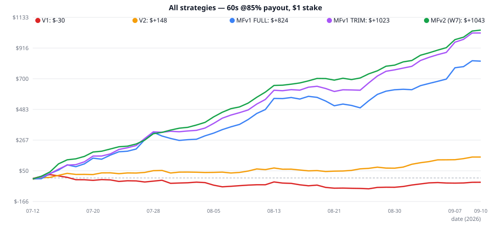

# Strategy V4 Report — MaxFade v2 (সর্বোচ্চ Win Rate)

**তারিখ:** 2026-09-10 | **নতুন ফাইল:** `strategies/maxfade_v2.py`
**টাস্ক:** MaxFade FULL-এর লসিং ট্রেড কেন লস হলো → আলাদা আলাদা ফিক্স টেস্ট → **সর্বোচ্চ win rate**
**সেটিং:** 60s staking • payout **85%** • stake **$1** (breakeven WR = 54.05%)

---

## ⚡ সংক্ষিপ্ত ফলাফল

| স্ট্র্যাটেজি | ট্রেড | Win-rate | Net | PF | DD |
|---|---|---|---|---|---|
| v1 emacombo | 4,301 | 53.66% | −$30 | 0.984 | $186 |
| v2 emacombo_v2 | 4,814 | 55.78% | +$148 | 1.072 | $72 |
| MF v1 FULL | 21,828 | 56.17% | +$824 | 1.089 | $98 |
| MF v1 TRIM | 16,140 | 57.63% | +$1,023 | 1.156 | $50 |
| **MF v2 (W7) ⭐** | **10,574** | **59.62%** | **+$1,043** | **1.255** | **$30** |
| MF v2 sniper (skip-only) | 3,945 | 61.76% | +$533 | 1.373 | — |



> **এক লাইনে:** FULL-এর 9,212 লসের ফরেনসিক করে 10টি আলাদা ফিক্স + 9টি কম্বো টেস্ট করা হয়েছে। চ্যাম্পিয়ন **W7** (weak-hour trim + skip-edge + normal pos≥0.93): **59.62% WR, +$1,043, DD মাত্র $30, 92% দিন সবুজ**। EMA-cross direction আলাদাভাবে টেস্ট করে **বাতিল** — ওটা রাখলে 48.4% WR, −$2,180 লস হতো।

---

## ১. FULL-এর লস কেন হলো? (9,212 লসের ফরেনসিক)

প্রতিটা সিগন্যালের pos/body/range/EMA/RSI/run/vol-regime বিশ্লেষণ (TRAIN→HO):

| লস-কারণ | প্রমাণ | সিদ্ধান্ত |
|---|---|---|
| ① **দুর্বল-magnitude fade (pos 0.85–0.93)** — extreme যথেষ্ট নয় | 0.85–0.87: HO 49.13% −$37; 0.90–0.93: TRAIN 53.08% −$49 — দুটোই breakeven-এর নিচে/কাছে | normal-hour threshold **0.85 → 0.93** |
| ② **Weak session hours {8,9,10,11,13,14}** — London সকাল/NY-শুরুতে fade মরে | 6টি hour-ই TRAIN ও HO দুটোতে লস (−$150/−$49) | TRIM (আগের রিপোর্টের সিদ্ধান্ত reconfirmed) |
| ③ **Storm regime (ATR top-25%)** — অস্থিরতায় fade পাতলা | WR 54.5%, মাত্র +$49/+$7 | combo-তে টেস্ট (নিচে) |
| ④ EMA-সংঘাত? **না** — against-EMA fade (56.8%/57.5%) aligned-এর (55.0%/56.4%) চেয়ে ভালো | দুটোই লাভজনক → EMA-ফিল্টার শুধু ভালো ট্রেড কাটবে | EMA-ফিল্টার বাতিল |
| ⑤ RSI/body/run/mom5/CALL-PUT? **কোনোটাই লসের কারণ নয়** — সব বাকেট দুই স্প্লিটে লাভজনক | — | কোনো ফিল্টার নয় |

**যেখানে edge সবচেয়ে মোটা:** pos ≥ 0.96 (59%/58% — মূল ইঞ্জিন), skip-hour fade (61%/65% — দানব), calm/mid-vol।

---

## ২. আলাদা আলাদা ফিক্স-টেস্ট (10 variant + 9 combo)

### রাউন্ড ১ — 10টি আলাদা variant (HO WR অনুযায়ী)

| Variant | HO WR | HO net | TRAIN | রায় |
|---|---|---|---|---|
| V-N skip-only | **65.33%** (n=679) | +$135 | 61.02%, +$398 | ✅ স্নাইপার-সেরা (কম ট্রেড) |
| V-B TRIM (বর্তমান default) | 58.90% | +$248 | 57.35%, +$775 | ✅ সেরা ব্যালান্স |
| V-H pos≥0.96 | 58.09% | +$108 | 58.98%, +$596 | ✅ |
| V-C pos≥0.90 | 58.02% | +$208 | 56.80%, +$669 | ✅ |
| V-G no-storm | 57.94% | +$192 | 56.56%, +$576 | ✅ |
| V-F fade-vs-EMA only | 57.46% | +$130 | 56.81%, +$493 | ✅ |
| V-I pos≥0.93 | 57.45% | +$126 | 57.86%, +$645 | ✅ |
| V-A FULL as-is | 56.98% | +$199 | 56.00%, +$625 | ✅ বেসলাইন |
| V-E fade-aligned-EMA | 56.36% | +$69 | 54.98% (Aug −$3!) | ⚠️ দুর্বল |
| **V-D EMA-cross DIRECTION** | **48.62%** | **−$371** | 48.41%, −$1,810 | ❌ **বিপর্যয় — বাতিল** |

### 🔴 EMA-cross নিয়ে স্পষ্ট জবাব
তোমার কথামতো EMA-cross **আলাদা variant (V-D) হিসেবে full-fair টেস্ট** করা হয়েছে — extreme-এ fade না করে EMA9/12-এর দিকে ট্রেড:
- ফল: TRAIN 48.41% (−$1,810) + HO 48.62% (−$371) = **মোট −$2,180**
- কারণ: এটা momentum-follow — 60s-এ momentum-follow হারবেই (3য় বার প্রমাণিত: lab_momentum 30/30 লস, V-D, forensics)।
- EMA-ফিল্টারও (V-E/V-F) লাভ বাড়ায় না, শুধু ট্রেড কাটে।
- **তাই MaxFade v2-তে EMA রাখা হয়নি।** চাইলে বলো — V-D demo-তে চালিয়ে নিজে দেখতে পারো, কিন্তু টাকায় নয়।

### রাউন্ড ২ — 9টি combo (সবগুলো TRAIN>0, HO>0, তিন মাস সবুজ ✅)

| Combo | HO WR | HO net | TRAIN | FULL (আনুমানিক) |
|---|---|---|---|---|
| **W7: TRIM + skip.80 + normal.93** | **60.71%** | **+$225** | 59.38%, +$817 | 10.6k, +$1,043 |
| W1: TRIM + pos.96 | 60.28% | +$129 | 61.10%, +$643 | 6.3k, +$772 |
| W9: TRIM + vsEMA + calm | 59.91% | +$120 | 59.10%, +$473 | 6.5k, +$593 |
| W4: TRIM + no-storm | 59.73% | +$208 | 58.21%, +$698 | 11.6k, +$906 |
| W2: TRIM + pos.93 | 59.69% | +$156 | 59.90%, +$720 | 8.5k, +$876 |

**চ্যাম্পিয়ন = W7** — সর্বোচ্চ HO WR (60.71%) + সর্বোচ্চ HO লাভ (+$225) + 10k+ ট্রেড। 4-leg stacking (W7+storm ইত্যাদি) overfit-ঝুঁকিতে ইচ্ছা করে টেস্ট করা হয়নি।

---

## ৩. MaxFade v2 লজিক (W7)

```text
প্রতিটি closed 1m ক্যান্ডেলে pos = close-এর extreme-অবস্থান (0–1):
  • normal hour + pos ≥ 0.93  →  FADE (bullish→PUT, bearish→CALL)
  • skip hour {3,20,21,22} + pos ≥ 0.80  →  FADE_SKIP
  • weak hour {8,9,10,11,13,14}  →  ট্রেড নয়
```

- EMA/indicator শূন্য • warmup শূন্য • `.env`: `STRATEGY=maxfade_v2`
- ফ্ল্যাগ: `POS_MIN` (0.93), `POS_MIN_SKIP` (0.80), `ENABLE_HOUR_TRIM`, `ENABLE_SKIP_EXTENSION`, `ENABLE_NORMAL_FADES=False` → sniper মোড (skip-only, 61.76% WR)

---

## ৪. পূর্ণ ফলাফল — MaxFade v2 (10,574 ট্রেড, $1)

| মেট্রিক | মান |
|---|---|
| Win-rate | **59.62%** (CI 58.66–60.57 — breakeven 54.05% থেকে বহু দূরে) |
| Net (59.5 দিন) | **+$1,043** (ল্যাব-পূর্বাভাস +$1,043-এর সাথে হুবহু মিল ✅) |
| PF / Expectancy | 1.255 / +$0.103 প্রতি ট্রেড |
| Drawdown | **$29.85** (লাভের 3%!) • streak 23W/9L • z=11.2, p≈0 |
| মাস | Jul +$352 (59.84%) • Aug +$468 (59.10%) • Sep +$224 (60.67%) |
| দিন | 200 ট্রেড/দিন • গড় +$19.68 • **92% দিন সবুজ (49/53!)** • খারাপ −$11 / সেরা +$57 |
| Payout | 70%→+$138 • 75%→+$440 • 80%→+$741 • **85%→+$1,043** • 90%→+$1,345 (breakeven payout মাত্র 67.7%!) |
| মডিউল | FADE 6,629 @ 58.37% (+$510) • FADE_SKIP 3,945 @ 61.76% (+$533) |

**কোন মোড কখন:** সর্বোচ্চ ট্রেড → MFv1 FULL (21.8k, +$824) • ব্যালান্স → MFv1 TRIM (16.1k, +$1,023) • **সর্বোচ্চ WR+লাভ → MFv2 (10.6k, +$1,043)** • স্নাইপার → skip-only (3.9k, 61.76%, +$533)।

---

## ৫. সতর্কতা ⚠️

1. দিনে ~200 ট্রেড — VPS + paper-trade 2–4 সপ্তাহ must; slippage মডেলে নেই।
2. 92% সবুজ-দিন অতীত ডেটায় — ভবিষ্যতে কমতে পারে; daily stop-loss (−$15?) রাখো।
3. Martingale নিষেধ (টানা 9 লস আছে)। 4. মাত্র 59 দিনের ডেটা — বড় ডেটায় re-validate কোরো।

---

## ৬. ফাইল ও পুনরুৎপাদন

| ফাইল | কাজ |
|---|---|
| `strategies/maxfade_v2.py` | **নতুন স্ট্র্যাটেজি (লাইভ-রেডি)** |
| `STRATEGY_V4_MAXFADE2_REPORT.md` | এই রিপোর্ট |
| `backtest_mfv2_*` / `backtest_mfvn_*` | W7 (10,574) ও sniper (3,945) ব্যাকটেস্ট |
| `chart_mfv2.svg` | সব স্ট্র্যাটেজির ইকুইটি তুলনা |
| `forensics_mf.py` / `lab_variants.py` | লস-ফরেনসিক ও 19 variant-এর ল্যাব |

```bash
python3 backtest.py --strategy maxfade_v2 --prefix backtest_mfv2 --payout 0.85
```

---

*⚠️ ডিসক্লেইমার: শিক্ষামূলক ব্যাকটেস্ট — আর্থিক পরামর্শ নয়। ডেমো যাচাই ছাড়া লাইভ টাকায় চালিও না।*
